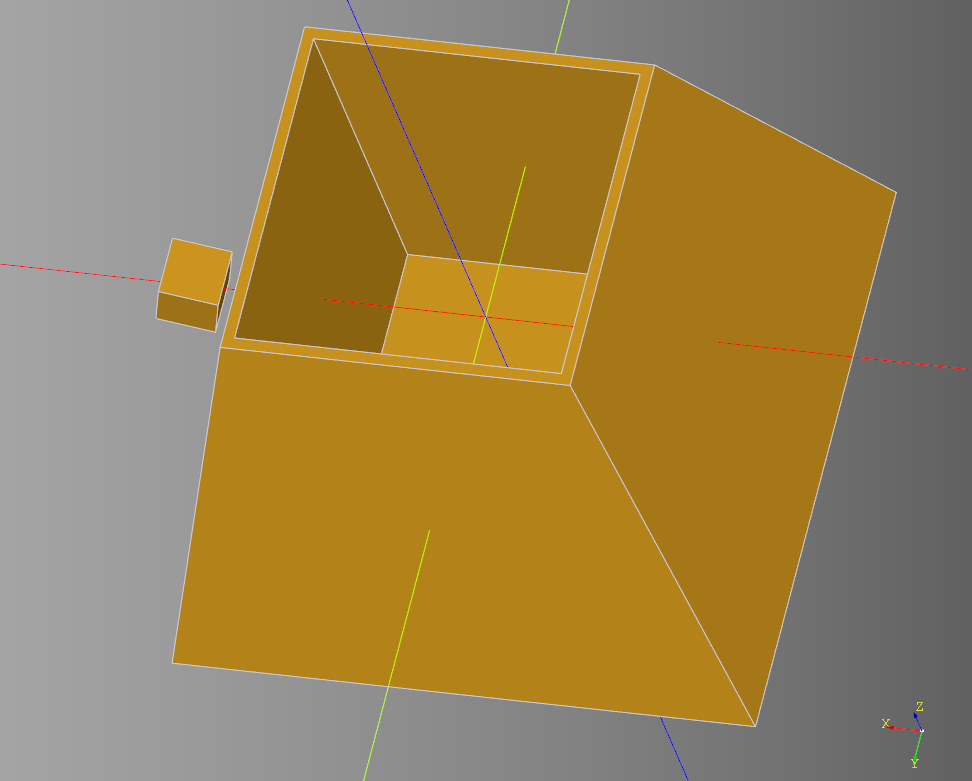
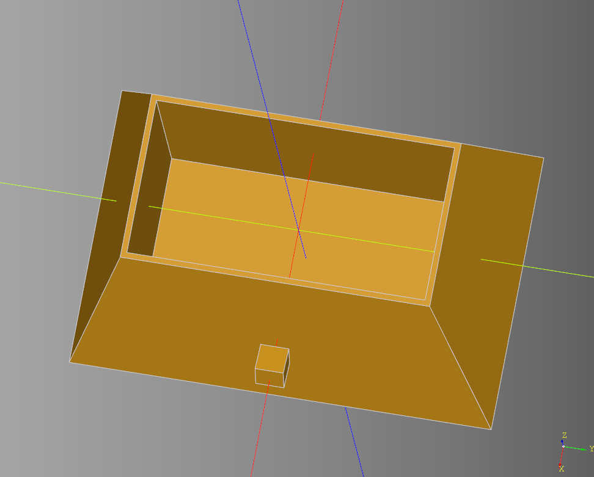
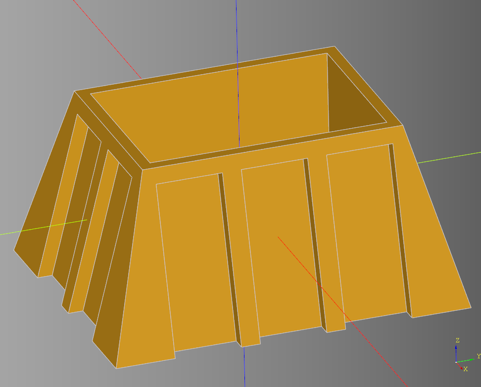
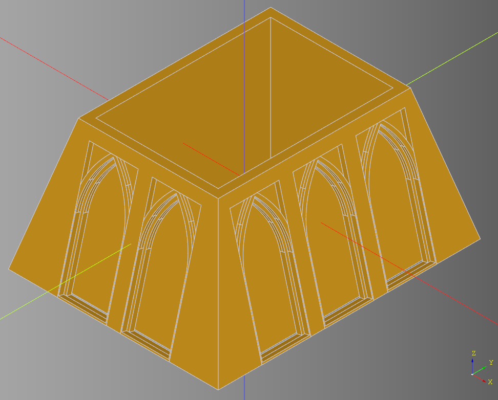

# Bunker Development

## Inspiration

https://www.reddit.com/r/PrintedMinis/comments/rgb3ln/i_painted_a_classic_warhammer_40k_bunker/


https://www.pinterest.com/pin/bunker-part-2--483855553698959743/


---

## Making The Outline

[Example 01 - Outline](../example/ex_01_outline.py)

``` python
import cadquery as cq
from cadqueryhelper import shape
from skirmishbunker import Base

class Bunker(Base):
    def __init__(self):
        super().__init__()
        self.length = 100
        self.width = 100
        self.height = 75
        self.inset = 10
        self.wedge = None

    def make(self):
        super().make()
        self.wedge = (
            cq.Workplane("XY" )
            .wedge(self.length,self.height,self.width,self.inset,self.inset,self.length-self.inset,self.width-self.inset)
            .rotate((1,0,0),(0,0,0),-90)
        )

    def build(self):
        super().build()
        return self.wedge

bp = Bunker()
bp.make()
rec = bp.build()

show_object(rec)
```


---
## Determine Wall Angle

[Code Example 02 - Angle Test](../example/ex_02_angle.py)

### New \_\_init__ Parameter
``` python
    self.angle = 0
```

### Angle code
``` python
def find_angle(self, length, height):
    '''
    Presumed length and height are part of a right triangle
    '''
    hyp = math.hypot(length, height)
    angle = length/hyp
    angle_radians = math.acos((angle))
    angle_deg = math.degrees(angle_radians)
    return angle_deg
```

### Update make method
``` python
def make(self):
    super().make()
    self.wedge = (
        cq.Workplane("XY" )
        .wedge(self.length,self.height,self.width,self.inset,self.inset,self.length-self.inset,self.width-self.inset)
        .rotate((1,0,0),(0,0,0),-90)
    )

    #determine angle
    self.angle =self.find_angle(self.inset, self.height)

    # Add example box
    box = cq.Workplane("XY").box(10,10,10).rotate((0,1,0),(0,0,0),-1*(self.angle)).translate((self.length/2,0,0))
    self.wedge = self.wedge.add(box)
```

### Generate examples
``` python
bp = Bunker()
bp.inset=40
bp.make()
rec = bp.build()
```


``` python
bp = Bunker()
bp.inset=10
bp.make()
rec = bp.build()
```


---

## Cut Out Interior
 I wanted a square interior as opposed to shelling the wedge outline.

 [Code Example 03 - Interior](../example/ex_03_interior.py)

 ### New \_\_init__ Parameter
 ``` python
 self.inset = 20
 ```

 ### Create interior_rectangle
``` python
interior_rectangle = (
    cq.Workplane("XY")
    .box(self.length-(2*(self.inset+self.wall_width)), self.width-(2*(self.inset+self.wall_width)), self.height-self.wall_width)
    .translate((0,0,self.wall_width/2))
)
```



### Width Test
``` python
bp = Bunker()
bp.inset=20
bp.width=150
bp.make()
rec = bp.build()
```



---
## Cut Panels

[Code Example 04 - Cut Panels](../example/ex_04_cut.py)

### New \_\_init__ Parameters
``` python
self.wall_width = 5
self.panel_length = 28
self.panel_width = 6
self.panel_padding = 4
```

### Generate cut panels
``` python
def make_cut_panels(self):
    length = self.length-(2*(self.inset+self.wall_width))
    width = self.width-(2*(self.inset+self.wall_width))
    height = self.height
    inset = self.inset
    p_length = self.panel_length
    p_width = self.panel_width
    padding = self.panel_padding

    cut_panel = cq.Workplane("XY").box(p_length, p_width, height - padding)
    x_panels_size = math.floor(length / (p_length + (padding)))
    y_panels_size = math.floor(width / (p_length + (padding)))

    x_pannels_plus = (
        series(cut_panel, x_panels_size, length_offset= padding*2)
        .rotate((1,0,0),(0,0,0),(self.angle)+90)
        .translate((0,((self.width-inset+(padding/2))/2)-p_width/2,-1*(padding)))
    )

    x_pannels_minus = (
        series(cut_panel, x_panels_size, length_offset= padding*2)
        .rotate((1,0,0),(0,0,0),-1*(self.angle+90))
        .translate((0,-1*(((self.width-inset+(padding/2))/2)-p_width/2),-1*(padding)))
    )

    y_pannels_plus = (
        series(cut_panel, y_panels_size, length_offset= padding*2)
        .rotate((0,0,1),(0,0,0),90)
        .rotate((0,1,0),(0,0,0),-1*(self.angle)+90)
        .translate((((self.length-inset+(padding/2))/2)-p_width/2,0,-1*(padding)))
    )

    y_pannels_minus = (
        series(cut_panel, y_panels_size, length_offset= padding*2)
        .rotate((0,0,1),(0,0,0),90)
        .rotate((0,1,0),(0,0,0),(self.angle)+90)
        .translate((-1*(((self.length-inset+(padding/2))/2)-p_width/2),0,-1*(padding)))
    )

    return x_pannels_plus.add(x_pannels_minus).add(y_pannels_plus).add(y_pannels_minus)
```

### Remove Cut Panels From Bunker
``` python
  # cut panels
  cut_panels = self.make_cut_panels()
  self.wedge = self.wedge.cut(cut_panels)
```

### Build the bunker
``` python
bp = Bunker()
bp.inset=20
bp.width=150
bp.length=120
bp.make()
rec = bp.build()
```



---

## Create Arch Detail

### New \_\_init__ Parameters
``` python
self.arch_padding_top = 3
self.arch_padding_sides = 3
self.arch_inner_height = 6
self.inner_arch_top = 5
self.inner_arch_sides = 4

self.panels = None
self.cut_panels = None
```

### Details
``` python
def arch_detail(self):
    length = self.length-(2*(self.inset+self.wall_width))
    width = self.width-(2*(self.inset+self.wall_width))
    height = self.height
    inset = self.inset
    p_length = self.panel_length
    p_width = self.panel_width
    padding = self.panel_padding

    panel_outline = cq.Workplane("XY").box(p_length, p_width, height - padding)
    arch = shape.arch_pointed(p_length+self.arch_padding_sides, p_width/2 , height - padding + self.arch_padding_top, ((height - padding)/2) + self.arch_inner_height).translate((0,-1*(p_width/4),0))
    inner_arch = shape.arch_pointed(p_length + self.arch_padding_sides - self.inner_arch_sides, p_width , height - padding + self.arch_padding_top - self.inner_arch_top, ((height - padding)/2) + self.arch_inner_height - self.inner_arch_sides)
    inner_inner_arch = shape.arch_pointed(p_length + self.arch_padding_sides - self.inner_arch_sides-3, p_width/2 , height - padding + self.arch_padding_top - self.inner_arch_top-3, ((height - padding)/2) + self.arch_inner_height - self.inner_arch_sides).translate((0,(p_width/4),-1.5))
    panel_back = cq.Workplane("XY").box(p_length, p_width/2, height - padding).translate((0,(p_width/4),0))
    panel_detail = cq.Workplane("XY").add(panel_back).add(arch)
    inside_arch = panel_back.cut(inner_inner_arch)
    panel = panel_outline.intersect(panel_detail).cut(inner_arch).add(inside_arch)
    return panel
```

### Update Build
``` python
def build(self):
    super().build()
    scene = (
        cq.Workplane("XY")
        #.add(self.wedge)
        .add(self.panels)
    )
    return scene
```


---

## Add Detail Panels to bunker

### Build Out make_detail_panels Method
``` python
def make_detail_panels(self):
      length = self.length-(2*(self.inset+self.wall_width))
      width = self.width-(2*(self.inset+self.wall_width))
      height = self.height
      inset = self.inset
      p_length = self.panel_length
      p_width = self.panel_width
      padding = self.panel_padding

      detail_panel = self.arch_detail()

      x_panels_size = math.floor(length / (p_length + (padding)))
      y_panels_size = math.floor(width / (p_length + (padding)))

      x_pannels_plus = (
          series(detail_panel, x_panels_size, length_offset= padding*2)
          .rotate((0,0,1),(0,0,0),180)
          .rotate((1,0,0),(0,0,0),(self.angle)-90)
          .translate((0,((self.width-inset+(padding/2))/2)-p_width/2,-1*(padding)))
      )

      x_pannels_minus = (
          series(detail_panel, x_panels_size, length_offset= padding*2)
          .rotate((1,0,0),(0,0,0),-1*(self.angle-90))
          .translate((0,-1*(((self.width-inset+(padding/2))/2)-p_width/2),-1*(padding)))
      )

      y_pannels_plus = (
          series(detail_panel, y_panels_size, length_offset= padding*2)
          .rotate((0,0,1),(0,0,0),-90)
          .rotate((0,1,0),(0,0,0),-1*(self.angle)+90)
          .translate((((self.length-inset+(padding/2))/2)-p_width/2,0,-1*(padding)))
      )

      y_pannels_minus = (
          series(detail_panel, y_panels_size, length_offset= padding*2)
          .rotate((0,0,1),(0,0,0),90)
          .rotate((0,1,0),(0,0,0),(self.angle)-90)
          .translate((-1*(((self.length-inset+(padding/2))/2)-p_width/2),0,-1*(padding)))
      )

      self.panels = x_pannels_plus.add(x_pannels_minus).add(y_pannels_plus).add(y_pannels_minus)
```


